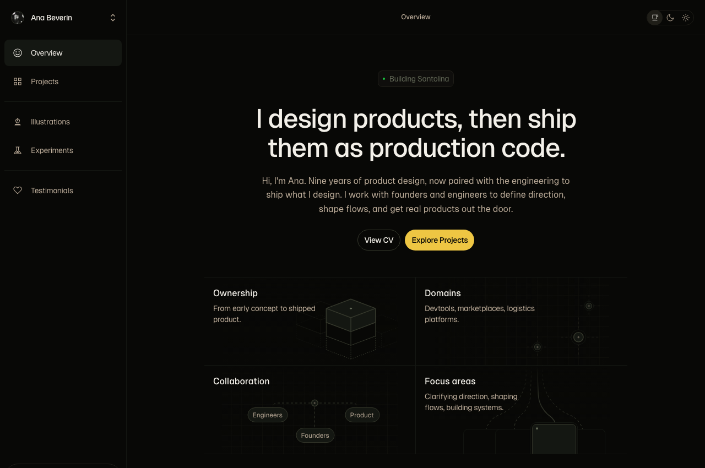

# Ana Beverin · Portfolio



**Live at [anabeverin.com](https://anabeverin.com)** — product designer who ships production code.

I'm a senior product designer with 9 years of experience, most of it as the sole designer at startups, owning discovery, IA, interaction design, and design systems end to end. More recently, I've been working in the design-to-code space: designing, prototyping, and shipping directly in React using Cursor, Claude Code, and Figma MCP.

This repository is the portfolio itself. I designed and built it from scratch, no template, no theme, as a place to document both my work and how I build.

I keep the portfolio public because I believe shipped work is more useful than screenshots. If you're curious how something works, the code is here to explore.

## What's inside

- **Design system:** semantic design tokens, CSS variables, Tailwind mappings, and live documentation at [/design-system](https://anabeverin.com/design-system).
- **Themes:** three interchangeable themes (warm, cool, light) built through token overrides rather than component-level styling.
- **Case studies:** selected work from Santolina, Shuttle, Neptune, MixLodge, and OptimoRoute, covering process, decisions, and outcomes.
- **Motion and interaction:** hand-built Framer Motion animations and interactive experiments.
- **Illustration:** a gallery of my illustration work; visual craft is part of the toolkit.

## How it's built

Next.js 15 (App Router) · Tailwind CSS + CSS Modules · Framer Motion · TypeScript · Resend for the contact form · deployed on Vercel.

Design system reference lives in [docs/DESIGN_SYSTEM.md](docs/DESIGN_SYSTEM.md).

## Run it locally

```bash
pnpm install
pnpm dev
```

Open [http://localhost:3000](http://localhost:3000). The contact form needs a `RESEND_API_KEY` in `.env.local`; everything else runs without configuration.

## Get in touch

I'm looking for product, design engineering, or early-stage design roles where I can own problems from concept to production.

- [anabeverin.com](https://anabeverin.com)
- [LinkedIn](https://linkedin.com/in/paradoxich)
- [CV](https://anabeverin.com/cv)
- ana.beverin@gmail.com
